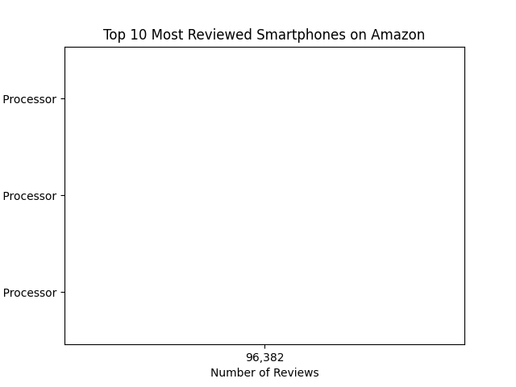

# 📱 Amazon Smartphone Data Analysis

## 📌 Project Overview
This project analyzes smartphone listings from Amazon to understand customer engagement, pricing trends, and product popularity using ratings and review counts.

## 📊 Dataset
Source: Amazon smartphone product listings

Features used:
- Product Name
- Price
- Rating
- Rating Count
- Product URL

## 🛠 Tools & Technologies
- Python
- Pandas
- Matplotlib
- Jupyter Notebook
- VS Code

## 📈 Analysis Performed
- Data cleaning and preprocessing
- Analysis of smartphone ratings and review counts
- Identification of most reviewed smartphones
- Visualization using bar charts

## 🔍 Key Insights
- Budget smartphones receive the highest number of reviews.
- Premium phones maintain strong ratings but receive fewer reviews.
- Review count is a stronger indicator of popularity than rating alone.
- Mid-range smartphones provide the best balance of price and customer satisfaction.

## 📊 Visualization
Top 10 most reviewed smartphones were visualized using bar charts.

## ✅ Conclusion
Affordable smartphones achieve higher customer engagement on Amazon due to a larger number of customer reviews and better market reach.

## 👩‍💻 Author
Elluru Nandini  
B.Tech – Computer Science and Engineering  
Aspiring Data Analyst | Python Enthusiast  
GitHub: https://github.com/ellurunandini80-prog
